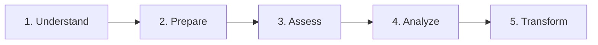

# Enterprise Team Topology Assessment Toolkit

A comprehensive set of tools and templates for conducting Team Topology assessments in large organizations with 20+ development teams and complex interdependencies.

## 📌 Is This Toolkit Right for You?

**✅ Perfect if you have:**
- 20+ development teams across multiple business units
- Complex cross-team dependencies and communication challenges
- Multiple technology platforms and shared services
- Executive support for organizational transformation
- 6-24 month timeline for systematic improvement

**❌ Consider alternatives if you have:**
- <10 teams in a single business unit
- Simple organizational structure
- Limited resources for comprehensive assessment

---

## 🗺️ Your Journey Overview



**Phase 1: Understand** (Week 1) → **Phase 2: Prepare** (Weeks 2-4) → **Phase 3: Assess** (Months 1-3) → **Phase 4: Analyze** (Month 4) → **Phase 5: Transform** (Months 5-24)

---

## 🎯 Phase 1: Understand the Framework

### Start Here: Core Concepts

**New to Team Topologies?** Start with the **[Quick Reference Guide](docs/01-quick-reference.md)** for essential team types and interaction modes.

**Ready for depth?** Read the **[Team Topologies Guide](docs/02-team-topologies-guide.md)** to understand:
- **4 Team Types**: Stream-Aligned, Platform, Enabling, Complicated Subsystem
- **3 Interaction Modes**: Collaboration, X-as-a-Service, Facilitating
- **Enterprise Challenges**: Cognitive load, flow optimization, cross-BU dependencies

### Key Questions to Answer:
- What team types do we likely have?
- Where are our biggest cross-business-unit friction points?
- What platform services are duplicated across business units?

---

## 🛠️ Phase 2: Prepare for Assessment

### Executive Alignment Checklist
- [ ] **C-Suite Sponsorship**: CEO/CTO commitment with dedicated budget
- [ ] **Business Unit Leaders**: VP/Director engagement across all BUs
- [ ] **Transformation Team**: Dedicated full-time team with cross-BU representation
- [ ] **Timeline Commitment**: 6-24 month transformation timeline approved
- [ ] **Change Management**: Communication strategy for organization-wide initiative

### Pre-Assessment Activities
1. **Document Current State**: Map all teams, business units, and reporting structures
2. **Baseline Metrics**: Establish current lead times, deployment frequency, team satisfaction
3. **Stakeholder Identification**: Identify team leads, architects, and business unit representatives
4. **Communication Plan**: Develop messaging strategy for organization-wide assessment

---

## 📊 Phase 3: Conduct Enterprise Assessment

### Assessment Tools & Approach

#### 🔍 **Option A: Survey-Centric Assessment (Recommended)**
**Timeline**: 6-10 weeks | **Coverage**: All teams | **Effort**: Medium | **Accuracy**: High

1. **[Enterprise Survey](team-topology-assessment-survey.md)** → Primary data collection method with comprehensive cross-BU analysis
2. **[Targeted Interviews](team-topology-interview-guide.md)** → 5-10 strategic interviews to validate survey insights
3. **[Dependency Mapping](dependency-mapping-canvas.md)** → Data-driven visualization based on survey responses
4. **[Optional Workshop](workshop-facilitation-guide.md)** → Single cross-BU validation workshop if needed

#### ⚡ **Option B: Pilot Assessment (Quick Start)**
**Timeline**: 3-4 weeks | **Coverage**: 5-8 teams | **Effort**: Low | **Accuracy**: Good

1. **Pilot Survey** → Deploy survey to representative teams across business units
2. **Validation Interviews** → 3-5 interviews with pilot team leads
3. **Data Analysis** → Apply scoring framework to pilot data

### Assessment Execution Guide

#### **Week 1-2: Survey Deployment & Promotion**
- Deploy **[Enterprise Survey](team-topology-assessment-survey.md)** organization-wide
- **Executive messaging** and follow-up to achieve 85%+ response rate
- **Pro Tip**: Use the **[Google Forms Setup Guide](google-forms-setup-guide.md)** for easy distribution and tracking
- **Survey monitoring**: Daily response rate tracking and targeted follow-ups

#### **Week 3-4: Survey Analysis & Pattern Identification**
- Apply **[Enterprise Scoring Framework](scoring-analysis-framework.md)** to survey responses
- Identify patterns, red flags, and areas requiring deeper investigation
- Generate preliminary team classifications and cross-BU dependency maps

#### **Week 5-8: Targeted Validation Interviews**
- Conduct **[Strategic Interviews](team-topology-interview-guide.md)** with 5-10 key stakeholders
- Focus on validating survey findings and exploring unexpected patterns
- Target teams with unclear classifications or high cross-BU dependencies

#### **Week 9-10: Optional Validation Workshop**
- **Only if needed**: Run single **[Cross-BU Workshop](workshop-facilitation-guide.md)** to validate major findings
- Focus on highest-impact cross-BU dependencies and platform consolidation opportunities
- 3-4 hours with 8-12 key representatives from across business units

---

## 📈 Phase 4: Analyze Results

### Analysis Process
1. **Apply Scoring Framework**: Use **[Enterprise Scoring Framework](scoring-analysis-framework.md)** to classify teams
2. **Identify Patterns**: Cross-BU dependencies, platform duplication, communication inefficiencies
3. **Generate Insights**: Team health scores, enterprise-wide optimization opportunities
4. **Create Reports**: Executive summary, business unit breakdowns, detailed recommendations

### Expected Outputs
- **Team Classifications**: Clear topology type for each team across all business units
- **Cross-BU Dependency Map**: Visualization of complex organizational interdependencies
- **Platform Consolidation Plan**: Opportunities to reduce service duplication
- **Health Assessment**: Red flags, optimization priorities, and improvement roadmap
- **Executive Dashboard**: High-level metrics and business case for transformation

---

## 🚀 Phase 5: Transform Your Organization

### Implementation Roadmap

#### **Months 1-6: Foundation & Pilot**
- **Executive Preparation**: C-suite alignment and resource allocation
- **Pilot Implementation**: 8-12 teams across multiple business units
- **Success Validation**: Measure flow metrics, team health, business impact

#### **Months 7-18: Enterprise Rollout**
- **Scale Proven Patterns**: Apply successful approaches across all business units
- **Platform Consolidation**: Standardize and consolidate platform services enterprise-wide
- **Cross-BU Optimization**: Implement improved interaction patterns across business unit boundaries

#### **Months 19-24: Continuous Improvement**
- **Advanced Capabilities**: AI-powered optimization, predictive analytics
- **Cultural Transformation**: Embed continuous improvement mindset
- **Organizational Learning**: Self-optimizing team topology capabilities

### Success Metrics & Targets
- **Flow Metrics**: <2 weeks lead time, daily deployments, <2hr MTTR, <5% change failure rate
- **Team Health**: >3.5/5 cognitive load comfort, <10% external dependencies, >7 NPS
- **Business Impact**: 50% faster time-to-market, 20% more experimentation, 30% fewer bugs

---

## 🎁 What's Included in This Toolkit

### 📚 **Strategy & Framework**
- **[Quick Reference Guide](docs/01-quick-reference.md)** - Essential team types and interaction modes
- **[Team Topologies Guide](docs/02-team-topologies-guide.md)** - Complete framework and strategy
- **[Cognitive Load Optimization](docs/03-cognitive-load-optimization.md)** - Foundational improvements
- **[Team & Platform Optimization](docs/04-team-platform-optimization.md)** - Advanced organizational strategies
- **[Implementation Roadmap](docs/05-implementation-roadmap.md)** - Detailed 12-month plan with timelines

### 📋 **Assessment Tools** (Primary: Survey-Based)
- **[Assessment Overview](assessment/)** - Complete assessment toolkit and guidance
- **[Enterprise Survey](assessment/survey.md)** - Primary assessment tool with comprehensive analysis
- **[Interview Guide](assessment/interview-guide.md)** - Strategic validation interviews
- **[Dependency Mapping](assessment/dependency-mapping.md)** - Visual dependency analysis
- **[Scoring Framework](assessment/scoring-framework.md)** - Classification and analysis system

### 🛠️ **Tools & Utilities**
- **[Tools Overview](tools/)** - Supporting tools and implementation guides
- **[Google Forms Setup](tools/google-forms-setup.md)** - Easy survey deployment guide
- **[Workshop Facilitation](tools/workshop-facilitation.md)** - Group assessment alternative

---

## 🔄 Getting Started Checklist

### ✅ **This Week** (Understanding Phase)
- [ ] Read the [Quick Reference Guide](docs/01-quick-reference.md) for core concepts
- [ ] Read the [Team Topologies Guide](docs/02-team-topologies-guide.md) for comprehensive framework
- [ ] Review the [Implementation Roadmap](docs/05-implementation-roadmap.md) for planning
- [ ] Explore [Assessment Tools](assessment/) to understand evaluation scope
- [ ] Identify executive sponsors and key stakeholders

### ✅ **Next 2-4 Weeks** (Preparation Phase)
- [ ] Secure executive sponsorship and budget allocation
- [ ] Map current organizational structure and teams
- [ ] Form cross-business-unit transformation team
- [ ] Develop communication plan for organization-wide initiative

### ✅ **Months 1-3** (Assessment Phase)
- [ ] Deploy [enterprise survey](assessment/survey.md) organization-wide
- [ ] Achieve 85%+ response rate using [tools and guides](tools/)
- [ ] Analyze data using [scoring framework](assessment/scoring-framework.md)
- [ ] Conduct strategic [validation interviews](assessment/interview-guide.md)
- [ ] Create [dependency mappings](assessment/dependency-mapping.md)
- [ ] Optional: Run validation workshop using [facilitation guide](tools/workshop-facilitation.md)

### ✅ **Month 4** (Analysis Phase)
- [ ] Apply scoring framework to classify all teams
- [ ] Generate enterprise health assessment
- [ ] Identify platform consolidation opportunities
- [ ] Create executive presentation and recommendations

### ✅ **Months 5+** (Transformation Phase)
- [ ] Begin pilot implementation with selected teams
- [ ] Scale successful patterns across business units
- [ ] Implement continuous improvement processes

---

## 📞 Need Help?

### 🤝 **After Assessment Support**
Once you have assessment data, this toolkit can be customized with your specific findings:
- Update strategy document with your actual team data
- Create customized recommendations based on your findings
- Develop team-specific action plans and improvement roadmaps

### 🔗 **Additional Resources**
- [Team Topologies Book](https://teamtopologies.com/) by Matthew Skelton and Manuel Pais
- [Team Topologies Website](https://teamtopologies.com/)

---

## 📄 License & Contributing

This project is licensed under the MIT License - see the [LICENSE](LICENSE) file for details.

Contributions and improvements are welcome based on the Team Topologies framework.

---

---

## 🗂️ Repository Structure

```
📁 docs/           - Complete framework and strategy guides
📁 assessment/     - Primary assessment tools and analysis
📁 tools/          - Supporting utilities and setup guides
📄 README.md       - This overview and starting point
```

### Quick Access Links
- 🚀 **Start Here**: [Quick Reference](docs/01-quick-reference.md)
- 📖 **Full Guide**: [Team Topologies Guide](docs/02-team-topologies-guide.md)
- 📋 **Assess Teams**: [Assessment Tools](assessment/)
- 🛠️ **Implementation**: [Implementation Roadmap](docs/05-implementation-roadmap.md)

---

**Version**: 2.1 - Restructured Edition
**Last Updated**: September 2024
**Recommended for**: Large enterprises with 20+ development teams and complex organizational structures